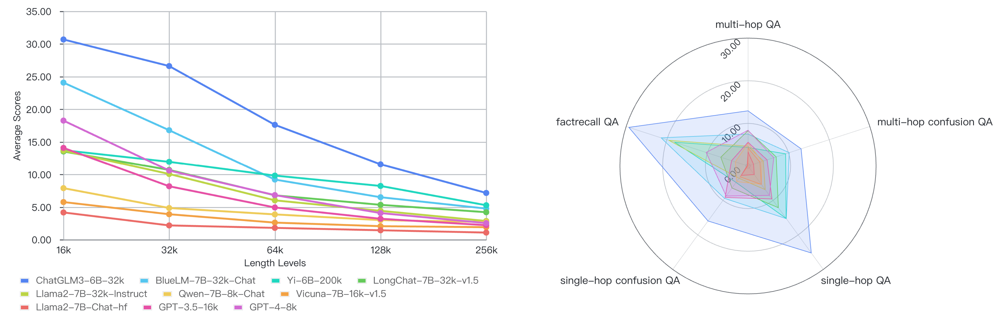
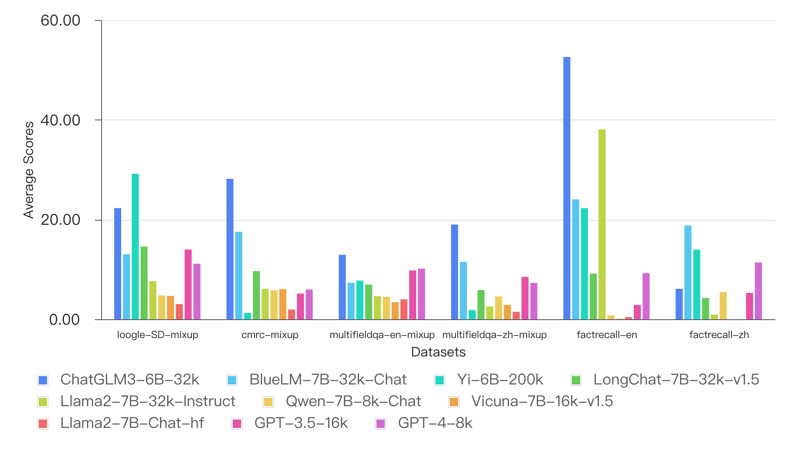

<p align="center">
    🤗 <a href="https://huggingface.co/datasets/Infinigence/LVEval" target="_blank">HF Repo</a> • 📃 <a href="https://arxiv.org/" target="_blank">Paper</a>
</p>

Read this in [English](README.md).

# _LV_-Eval: 5个长度等级、最长支持256k的长文本评测基准

**_LV_-Eval**是一个具备5个长度等级（16k、32k、64k、128k和256k）、最大文本测试长度达到256k的长文本评测基准。**_LV_-Eval**的平均文本长度达到102,380字，最小/最大文本长度为11,896/387,406字。**_LV_-Eval**主要有两类评测任务——单跳QA和多跳QA，共包含11个涵盖中英文的评测数据子集。**_LV_-Eval**设计时引入3个关键技术：干扰事实插入（**C**onfusiong **F**acts **I**nsertion，CFI）提高挑战性，关键词和短语替换（**K**eyword and **P**hrase **R**eplacement，KPR）减少信息泄漏，以及基于关键词召回的评测指标（**A**nswer **K**eywords，AK，指代结合答案关键词和字词黑名单的评价指标）提高评测数值客观性。我们希望*LV*-Eval为未来长文本大语言模型的研究发展提供有价值的性能参考。

## 关键特性

* **超长文本长度**: **_LV_-Eval**由5个长度等级构成，分别是16k、32k、64k、128k以及256k。同一数据集在不同长度等级下具有相同的问答对集合，只是构成各长度等级的上下文长度不同。我们的目的是保持问答对一致的情况下，充分测试模型在不同长度等级上下文中的性能表现，更可控地评估模型的长文本能力。
* **结合混淆和干扰信息来提升评测难度**: 构建测试数据的过程中，我们将问答相关文档和无关文档混合拼接起来构成测试文档。该构建方式在扩展文本长度的同时，可有效评测模型从冗长混淆文本中提取关键信息的能力。此外，我们还使用GPT-4生成多个干扰信息，并在人工检查后随机插入到测试文档中，以评测模型在有相似事实描述的干扰下保持准确推理的能力。
* **替换数据中的关键信息以减少信息泄漏**: 为了解决长文本能力评测中由于信息泄漏而引起的指标虚高问题，我们采用关键词和短语替换的方式处理数据的上下文以及问答对，替换后的信息不再是公共知识，也在很大程度上与数据源的原始信息不同。所有的替换词和短语标注都由人类标注员完成。这样一来，**_LV_-Eval**能够严格要求被测模型根据数据中实际提供的上下文信息来回答问题，而非通过“背题”或者预训练阶段的常识记忆的方式来回答问题。
* **基于关键词召回的指标可更客观公正地评测模型性能**: 目前已有的评测指标（如F1分、ROUGH等）存在受回答格式和无关字词干扰的问题，容易导致评测结果虚高。为解决这个问题，我们人工标注了答案关键词和字词黑名单。答案关键词是从原始答案中提取的最具回答信息量的词汇或短语，而字词黑名单主要包含一些无信息量的代词、助词，比如“的”、“和”、“了”等。评测指标的计算被设计为两阶段过程，以F1分数为例：第一阶段先计算模型回答对答案关键词的召回分数，如果分数低于预设阈值，则直接计0分；如果召回分数高于阈值，则进一步计算模型回答与完整答案的F1分数——首先将字词黑名单中的词从回答和答案中过滤掉，再正常进行F1分数计算。这样一来，评测指标可使得模型得分更加客观公正。

## **_LV_-Eval**总览 
在下面的表格中，CFI是**C**onfusiong **F**acts **I**nsertion的缩写，表示该数据集插入了干扰事实，KPR是**K**eyword and **P**hrase **R**eplacement的缩写，表示该数据集进行了关键词和短语替换，AK是**A**nswer **K**eywords的缩写，表示该数据集标注了答案中的关键词，用于基于关键词召回的指标计算。

#### 单跳QA
单跳QA任务中，支持回答问题的证据或事实仅出现在上下文中的某一个位置。

| 数据集 | CFI | KPR数据量 | AK | 语言 | QA对数量 | 文本数量 |
|:---------------------:|:---:|-------|:--:|:--------:|:----------:|:----------:|
|    loogle-SD-mixup    |     |       |  ✔ |    英    |     160    |     800    |
|       cmrc-mixup      |     |  786  |    |    中    |     200    |    1,000   |
| multifieldqa-en-mixup |  ✔  |  476  |  ✔ |    英    |     101    |     505    |
| multifieldqa-zh-mixup |  ✔  |  424  |  ✔ |    中    |     133    |     665    |
|     factrecall-en     |  ✔  |   3   |  ✔ |    英    |      1     |   200 * 5  |
|     factrecall-zh     |  ✔  |   3   |  ✔ |    中    |      1     |   200 * 5  |

**factrecall-en**和**factrecall-zh**被设计用于“大海捞针”压力测试，因此其所有数据的qa对保持一致。

#### 多跳QA
多跳QA任务中，支持回答问题的证据或事实会出现在上下文中多个不同的位置，需要汇总多处关键信息才能得到正确答案。

|        数据集        | CFI | KPR数据量 | AK | 语言 | QA对数量 | 文本数量 |
|:---------------------:|:---:|-------|:--:|:--------:|:----------:|:----------:|
|     dureader-mixup    |     |       |    |    中    |     176    |     880    |
|    loogle-CR-mixup    |     |       |  ✔ |    英    |     99     |     495    |
|    loogle-MR-mixup    |     |       |  ✔ |    英    |     139    |     695    |
|   hotpotwikiqa-mixup  |  ✔  |  232  |  ✔ |    英    |     124    |     620    |
|       lic-mixup       |  ✔  |       |  ✔ |    中    |     197    |     985    |

## 目录
- [排行榜](#排行榜)
- [在***LV*-Eval**上评测你的模型](#在***LV*-Eval**上评测你的模型)
- [各数据集上的详细评测结果](#各数据集上的详细评测结果)
- [许可](#许可)
- [引用](#引用)

<a name="排行榜"></a>
## 排行榜
以下是各模型不同长度等级下在所有任务上的平均得分（%），我们共评测了2个商用模型和8个开源模型

#### 已评测的模型
|       模型名称       |     是否监督微调    | 上下文窗口长度 |        HuggingFace / API 源        |
|:----------------------:|:----------:|:--------------:|:----------------------------------------:|
|    Llama2-7B-Chat-hf   | ✔ |      $4k$      |       meta-llama/Llama-2-7b-chat-hf      |
|     Qwen-7B-8k-Chat    | ✔ |      $8k$      |             Qwen/Qwen-7B-Chat            |
|   Vicuna-7B-16k-v1.5   | ✔ |      $16k$     |         lmsys/vicuna-7b-v1.5-16k         |
|     ChatGLM3-6B-32k    | ✔ |      $32k$     |           THUDM/chatglm3-6b-32k          |
| Llama2-7B-32k-Instruct | ✔ |      $32k$     | togethercomputer/Llama-2-7B-32K-Instruct |
|   BlueLM-7B-32k-Chat   | ✔ |      $32k$     |        vivo-ai/BlueLM-7B-Chat-32K        |
|  LongChat-7B-32k-v1.5  | ✔ |      $32k$     |        lmsys/longchat-7b-v1.5-32k        |
|       Yi-6B-200k       |            |     $200k$     |             01-ai/Yi-6B-200K             |
|        GPT-4-8k        | ✔ |      $8k$      |                gpt-4-0613                |
|       GPT-3.5-16k      | ✔ |      $16k$     |            gpt-3.5-turbo-1106            |            

#### 整体结果


|      模型名称       |  $16k$ |  $32k$ |  $64k$ | $128k$ | $256k$ |
|:----------------------:|:------:|:------:|:------:|:------:|:------:|
|     ChatGLM3-6B-32k    | 30.70  | 26.62  | 17.62  | 11.56  |  7.17  |
|   BlueLM-7B-32k-Chat   | 24.09  | 16.80  | 9.22   | 6.51   |  4.77  |
|       Yi-6B-200k       | 13.73  | 11.95  | 9.82   | 8.24   |  5.28  |
|  LongChat-7B-32k-v1.5  | 13.54  | 10.70  | 6.80   | 5.35   |  4.22  |
| Llama2-7B-32k-Instruct | 13.66  | 10.07  | 6.03   | 4.43   |  2.87  |
|     Qwen-7B-8k-Chat    | 7.90   | 4.86   | 3.88   | 3.00   |  2.71  |
|   Vicuna-7B-16k-v1.5   | 5.77   | 3.90   | 2.62   | 2.07   |  1.92  |
|    Llama2-7B-Chat-hf   | 4.18   | 2.19   | 1.81   | 1.45   |  1.10  |
|       GPT-3.5-16k      | 14.09  | 8.19   | 4.94   | 3.21   |  2.23  |
|        GPT-4-8k        | 18.27  | 10.60  | 6.84   | 4.08   |  2.54  |

<a name="在***LV*-Eval**上评测你的模型"></a>
## 在***LV*-Eval**上评测你的模型

#### 加载数据
```python
from datasets import load_dataset

DATASET_NAMES = [
    "hotpotwikiqa_mixup", "loogle_SD_mixup", "loogle_CR_mixup", "loogle_MIR_mixup", \
    "multifieldqa_en_mixup", "multifieldqa_zh_mixup", "factrecall_en", "factrecall_zh", \
    "cmrc_mixup", "lic_mixup", "dureader_mixup"
]

DATASET_LENGTH_LEVEL = [
    '16k', '32k', '64k', '128k', '256k'
]

def get_dataset_names(dataset_names, length_levels):
    datasets = []
    for name in dataset_names:
        for length in length_levels:
            datasets.append(f"{name}_{length}")
    return datasets

for dataset in get_dataset_names(DATASET_NAMES, DATASET_LENGTH_LEVEL):
    data = load_dataset("Infinigence/LVEval", dataset, split='test', token=True)
```

你也可以将数据下载到本地后进行加载，数据链接：`https://huggingface.co/datasets/Infinigence/LVEval/resolve/main/{task_name}.zip`

注意，请指定你想下载的子任务的名称{task_name}。

例如，如果你想下载hotpotwikiqa_mixup，需要访问这个链接：https://huggingface.co/datasets/Infinigence/LVEval/resolve/main/hotpotwikiqa_mixup.zip

#### 数据格式
**_LV_-Eval**中的所有数据都遵循以下格式。
```json
{
    "input": "问题",
    "context": "上下文",
    "answers": "答案",
    "length": "上下文文本长度 (中文计字符数，英文计词数)",
    "dataset": "数据集名称",
    "language": "数据语言类型",
    "answer_keywords": "从答案中过滤得到的关键词",
    "confusing_facts": "插入到上下文中的干扰事实描述，增加测试难度",
}
```

#### 评测
通过pip安装python环境: `pip install -r requirements.txt`。

通常，我们用多卡数据并行的模式运行评测，节省评测时间。需要在shell脚本依次输入的命令参数有—————模型路径、模型名称(注意名称应与[utils.py](utils.py)中的build_chat函数适配，以定制提示词格式)、以及模型最大长度(-500以预留输出窗口)。例如：
```bash
bash batch_eval_multiple.sh /home/user/workspace/public_models/chatglm3-6b-32k chatglm3 31500
```
对于上下文窗口特别长或者本身尺寸比较大的模型，避免显存爆炸，我们建议用Hugging Face自带的'auto'模型并行模式运行评测。例如：
```bash
bash batch_eval_single.sh /home/user/workspace/public_models/Yi-6B-200K yi-200k 199500
```
此外，我们也可以分步骤进行评测。先运行[prediction.py](predictioin.py)得到前向推理的预测结果。需要通过`--model-path`选择待测模型、`--model-name`定义模型名称、`--model-max-len`输入模型最大窗口长度，以及`--output-dir`定义结果文件输出路径。例如：
```bash
python prediction.py --model-path /home/user/workspace/public_models/chatglm3-6b-32k --model-name chatglm3 --model-max-len 31500 --output-dir ./outputs/
```
前向推理的预测结果将保存在`[output dir]/[model name]`中。
然后我们可运行[evaluation.py](evaluation.py)来对上述得到的预测结果进行打分，得到**_LV_-Eval**最终的评测结果。需要通过`--input-dir`来定义预测结果的路径。例如：
```bash
python evaluation.py --input-dir ./outputs/chatglm3/
```
而后，我们将在shell命令行中看到打印的评测结果，并且在预测结果的同级目录下得到`results.json`和`results.csv`的评测结果文件。

更多定制的需求可通过[config.py](config.py)（选择想要测试的数据子集以及长度等级）和[utils.py](utils.py)（与模型相关的提示格式定制）来选择和定义。

此外，对于商用模型，我们以另一个脚本来调用其API进行评测。例如拼测OpenAI的GPT系列模型，我们需要设置模型名称和模型最大窗口长度。
注意，评测前需要设置OPENAI_API_KEY环境变量。
```bash
bash batch_eval_gpt_single.sh gpt-4-1106-preview 127500
```

<a name="各数据集上的详细评测结果"></a>
## 各数据集上的详细评测结果
以下是各模型不同任务下在所有长度等级上的平均得分（%）。

#### 单跳QA


|       模型名称       | loogle-SD-mixup | cmrc-mixup | multifieldqa-en-mixup | multifieldqa-zh-mixup | factrecall-en | factrecall-zh |
|:----------------------:|:---------------:|:----------:|:---------------------:|:---------------------:|:-------------:|:-------------:|
|     ChatGLM3-6B-32k    |      22.29      |    28.16   |         12.93        |        18.99        |      52.60     |      6.10      |
|   BlueLM-7B-32k-Chat   |      13.02      |    17.53   |         7.32        |         11.49       |     24.03    |      18.80     |
|       Yi-6B-200k       |      29.17      |    1.27   |         7.75        |        1.84        |     22.28    |     13.95     |
|  LongChat-7B-32k-v1.5  |      14.56      |    9.65    |         6.95        |         5.86       |     9.14     |      4.28     |
| Llama2-7B-32k-Instruct |      7.63       |    6.12   |         4.63        |         2.56       |     38.09     |      0.92     |
|     Qwen-7B-8k-Chat    |      4.78       |    5.81   |         4.52        |         4.57       |      0.80      |      5.45     |
|   Vicuna-7B-16k-v1.5   |      4.68       |    6.04   |         3.44        |         2.89       |      0.09     |       0       |
|    Llama2-7B-Chat-hf   |      3.04       |    1.97   |         3.99        |         1.48       |     0.45     |       0       |
|       GPT-3.5-16k      |      13.99     |    5.16   |         9.78        |         8.51       |     2.87     |      5.28     |
|        GPT-4-8k        |      11.13     |    5.96    |         10.16        |        7.29        |     9.25    |     11.39    |

#### 多跳QA


|       模型名称       | dureader-mixup | loogle-CR-mixup | loogle-MR-mixup | hotpotwikiqa-mixup | lic-mixup |  
|:----------------------:|:--------------:|:---------------:|:---------------:|:------------------:|:---------:|
|     ChatGLM3-6B-32k    |     19.57     |      10.17     |      9.10      |       11.15       |   15.02  |
|   BlueLM-7B-32k-Chat   |     14.61     |      5.04      |      2.87      |       11.22       |   9.11   |
|       Yi-6B-200k       |      2.83      |      5.82      |      4.41      |       12.42       |   6.12   |
|  LongChat-7B-32k-v1.5  |     10.34     |       8.59      |      6.03      |        6.98       |   6.92   |
| Llama2-7B-32k-Instruct |      9.57     |      2.51      |      1.92      |        2.31       |   5.27   |
|     Qwen-7B-8k-Chat    |     10.42     |      3.14      |      2.70      |        2.23       |   4.77   |
|   Vicuna-7B-16k-v1.5   |      7.18     |      3.26      |      2.31      |        1.95        |   4.00   |
|    Llama2-7B-Chat-hf   |      5.49      |      2.62      |      1.80      |        1.74        |    1.02   |
|       GPT-3.5-16k      |      4.87     |      6.09      |      5.87      |        5.88       |   3.53   |
|        GPT-4-8k        |     12.07     |       7.26      |      5.91      |        7.46       |   5.28   |

以下是各模型在各个数据集下5个长度等级中的详细得分。

#### loogle-SD-mixup
|       模型名称       | $16k$ | $32k$ | $64k$ | $128k$ | $256k$ |
|:----------------------:|-------|-------|-------|--------|--------|
|     ChatGLM3-6B-32k    | 41.82 | 30.31 | 19.07 | 11.34  | 8.92   |
|   BlueLM-7B-32k-Chat   | 34.34 | 15.10  | 4.95  | 5.32   | 5.41   |
|       Yi-6B-200k       | 39.56 | 36.48 | 31.71 | 25.71  | 12.37  |
|  LongChat-7B-32k-v1.5  | 27.42 | 18.21 | 12.09 | 9.11   | 5.97   |
| Llama2-7B-32k-Instruct | 13.94 | 10.58 | 5.53  | 4.80    | 3.30    |
|     Qwen-7B-8k-Chat    | 10.54 | 4.70   | 2.40   | 3.25   | 3.02   |
|   Vicuna-7B-16k-v1.5   | 8.79  | 4.90   | 3.07  | 4.24   | 2.39   |
|    Llama2-7B-Chat-hf   | 6.75  | 2.61  | 2.58  | 2.04   | 1.24   |
|       GPT-3.5-16k      | 31.67 | 18.56 | 10.41 | 5.74   | 3.56   |
|        GPT-4-8k        | 27.01 | 14.01 | 8.00     | 5.14   | 1.48   |

#### cmrc-mixup
|       模型名称       | $16k$ | $32k$ | $64k$ | $128k$ | $256k$ |
|:----------------------:|-------|-------|-------|--------|--------|
|     ChatGLM3-6B-32k    | 51.21 | 46.34 | 20.71 | 14.16  | 8.38   |
|   BlueLM-7B-32k-Chat   | 45.89 | 19.53 | 10.66 | 7.06   | 4.51   |
|       Yi-6B-200k       | 1.05  | 0.35  | 0.84  | 1.58   | 2.54   |
|  LongChat-7B-32k-v1.5  | 20.99 | 10.77 | 8.97  | 3.77   | 3.75   |
| Llama2-7B-32k-Instruct | 13.86 | 7.31  | 4.10   | 2.95   | 2.40    |
|     Qwen-7B-8k-Chat    | 11.13 | 5.32  | 4.68  | 3.81   | 4.09   |
|   Vicuna-7B-16k-v1.5   | 11.75 | 6.55  | 5.04  | 2.75   | 4.13   |
|    Llama2-7B-Chat-hf   | 3.85  | 1.08  | 1.72  | 1.64   | 1.54   |
|       GPT-3.5-16k      | 12.19 | 6.00     | 3.57  | 2.73   | 1.32   |
|        GPT-4-8k        | 14.67 | 3.33  | 5.31  | 3.81   | 2.68   |

#### multifieldqa-en-mixup				
|       模型名称       | $16k$ | $32k$ | $64k$ | $128k$ | $256k$ |
|:----------------------:|-------|-------|-------|--------|--------|
|     ChatGLM3-6B-32k    | 25.40  | 12.78 | 12.32 |  9.89  | 4.24   |
|   BlueLM-7B-32k-Chat   | 11.82 | 6.34  | 8.38  |  5.29  | 4.78   |
|       Yi-6B-200k       | 10.01 | 9.24  | 8.83  |  5.98  | 4.69   |
|  LongChat-7B-32k-v1.5  | 12.02 | 7.58  | 7.84  |  3.11  | 4.22   |
| Llama2-7B-32k-Instruct | 8.03  | 4.96  | 4.12  |  3.90   | 2.13   |
|     Qwen-7B-8k-Chat    | 7.66  | 3.61  | 5.23  |  3.64  | 2.44   |
|   Vicuna-7B-16k-v1.5   | 6.29  | 4.32  | 2.79  |  2.51  | 1.28   |
|    Llama2-7B-Chat-hf   | 8.81  | 5.55  | 1.58  |  2.54  | 1.49   |
|       GPT-3.5-16k      | 18.78 | 11.59 | 7.38  |  7.95  | 3.21   |
|        GPT-4-8k        | 19.00    | 12.69 | 8.30   |  7.25  | 3.54   |

#### multifieldqa-zh-mixup				
|       模型名称       | $16k$ | $32k$ | $64k$ | $128k$ | $256k$ |
|:----------------------:|-------|-------|-------|--------|--------|
|     ChatGLM3-6B-32k    | 32.38 | 24.48 | 20.97 | 10.00   | 7.05   |
|   BlueLM-7B-32k-Chat   | 22.05 | 17.64 | 7.36  | 5.90    | 4.48   |
|       Yi-6B-200k       | 2.85  | 0.75  | 1.89  | 2.11   | 1.58   |
|  LongChat-7B-32k-v1.5  | 9.81  | 8.82  | 3.23  | 3.54   | 3.92   |
| Llama2-7B-32k-Instruct | 4.55  | 3.93  | 1.45  | 1.74   | 1.15   |
|     Qwen-7B-8k-Chat    | 8.82  | 5.68  | 3.01  | 2.84   | 2.52   |
|   Vicuna-7B-16k-v1.5   | 5.82  | 4.45  | 2.03  | 0.88   | 1.26   |
|    Llama2-7B-Chat-hf   | 4.72  | 1.21  | 0.68  | 0.24   | 0.56   |
|       GPT-3.5-16k      | 18.94 | 12.21 | 6.29  | 2.94   | 2.15   |
|        GPT-4-8k        | 17.61 | 11.18 | 4.99  | 1.76   | 0.92   |

#### factrecall-en
|       模型名称       | $16k$ | $32k$ | $64k$ | $128k$ | $256k$ |
|:----------------------:|-------|-------|-------|--------|--------|
|     ChatGLM3-6B-32k    | 91.50  | 89.00    | 46.00    | 24.00     | 12.5   |
|   BlueLM-7B-32k-Chat   | 58.50  | 32.17 | 15.50  | 9.00      | 5.00      |
|       Yi-6B-200k       | 24.88 | 23.09 | 24.96 | 22.04  | 16.44  |
|  LongChat-7B-32k-v1.5  | 9.22  | 14.33 | 8.31  | 7.86   | 6.00      |
| Llama2-7B-32k-Instruct | 75.20  | 56.00    | 33.00    | 17.85  | 8.40    |
|     Qwen-7B-8k-Chat    | 1.77  | 1.12  | 0.71  | 0.18   | 0.22   |
|   Vicuna-7B-16k-v1.5   | 0     | 0     | 0     | 0.25   | 0.20    |
|    Llama2-7B-Chat-hf   | 1.08  | 0.46  | 0.31  | 0.23   | 0.15   |
|       GPT-3.5-16k      | 8.25  | 3.27  | 1.80  | 0.60   | 0.45   |
|        GPT-4-8k        | 23.40 | 11.84  | 5.21  | 4.03   | 1.79   |

#### factrecall-zh
|       模型名称       | $16k$ | $32k$ | $64k$ | $128k$ | $256k$ |
|:----------------------:|-------|-------|-------|--------|--------|
|     ChatGLM3-6B-32k    | 0     | 2.00     | 12.50  | 9.00      | 7.00      |
|   BlueLM-7B-32k-Chat   | 19.00    | 37.00    | 20.00    | 12.50   | 5.50    |
|       Yi-6B-200k       | 25.73 | 16.86 | 12.41 | 10.13  | 4.62   |
|  LongChat-7B-32k-v1.5  | 7.20   | 5.00     | 3.50   | 3.70    | 2.00      |
| Llama2-7B-32k-Instruct | 2.55  | 0.74  | 0.53  | 0.49   | 0.29   |
|     Qwen-7B-8k-Chat    | 15.75 | 6.00     | 3.50   | 1.50    | 0.50    |
|   Vicuna-7B-16k-v1.5   | 0     | 0     | 0     | 0      | 0      |
|    Llama2-7B-Chat-hf   | 0     | 0     | 0     | 0      | 0      |
|       GPT-3.5-16k      | 14.51 | 6.70   | 2.49  | 1.72   | 0.98   |
|        GPT-4-8k        | 28.03 | 15.24 | 8.08  | 3.58   | 2.00      |

#### dureader-mixup
|       模型名称       | $16k$ | $32k$ | $64k$ | $128k$ | $256k$ |
|:----------------------:|-------|-------|-------|--------|--------|
|     ChatGLM3-6B-32k    | 23.99 | 25.21 | 22.01 | 17.94  | 8.72   |
|   BlueLM-7B-32k-Chat   | 19.40  | 19.74 | 14.44 | 10.95  | 8.51   |
|       Yi-6B-200k       | 2.87  | 2.98  | 2.88  | 2.36   | 3.06   |
|  LongChat-7B-32k-v1.5  | 13.44 | 11.57 | 9.23  | 9.51   | 7.96   |
| Llama2-7B-32k-Instruct | 11.82 | 10.65 | 8.58  | 9.34   | 7.48   |
|     Qwen-7B-8k-Chat    | 12.00    | 12.80  | 10.48 | 8.15   | 8.65   |
|   Vicuna-7B-16k-v1.5   | 9.67  | 7.65  | 6.62  | 6.25   | 5.70    |
|    Llama2-7B-Chat-hf   | 7.21  | 5.42  | 5.59  | 4.78   | 4.45   |
|       GPT-3.5-16k      | 8.01  | 5.26  | 4.26  | 3.30    | 3.50    |
|        GPT-4-8k        | 19.14 | 13.64 | 12.66 | 8.19   | 6.71   |

#### loogle-CR-mixup				
|       模型名称       | $16k$ | $32k$ | $64k$ | $128k$ | $256k$ |
|:----------------------:|-------|-------|-------|--------|--------|
|     ChatGLM3-6B-32k    | 14.41 | 14.10  | 9.92  | 6.95   | 5.46   |
|   BlueLM-7B-32k-Chat   | 9.01  | 7.36  | 3.81  | 2.40    | 2.60    |
|       Yi-6B-200k       | 8.25  | 8.83  | 4.73  | 4.05   | 3.23   |
|  LongChat-7B-32k-v1.5  | 11.25 | 11.17 | 9.31  | 6.19   | 5.03   |
| Llama2-7B-32k-Instruct | 3.11  | 2.82  | 2.01  | 2.46   | 2.16   |
|     Qwen-7B-8k-Chat    | 5.48  | 3.30   | 3.82  | 1.14   | 1.94   |
|   Vicuna-7B-16k-v1.5   | 5.00     | 4.25  | 3.76  | 1.99   | 1.28   |
|    Llama2-7B-Chat-hf   | 3.69  | 3.29  | 3.13  | 2.19   | 0.81   |
|       GPT-3.5-16k      | 10.04 | 8.39  | 5.58  | 3.08   | 3.37   |
|        GPT-4-8k        | 12.68 | 10.40  | 6.48  | 2.83   | 3.91   |

#### loogle-MR-mixup
|       模型名称       | $16k$ | $32k$ | $64k$ | $128k$ | $256k$ |
|:----------------------:|-------|-------|-------|--------|--------|
|     ChatGLM3-6B-32k    | 15.83 | 11.62 | 7.00     | 7.24   | 3.82   |
|   BlueLM-7B-32k-Chat   | 4.90   | 3.14  | 1.68  | 2.46   | 2.19   |
|       Yi-6B-200k       | 6.94  | 7.67  | 2.69  | 3.44   | 1.32   |
|  LongChat-7B-32k-v1.5  | 10.53 | 9.51  | 3.04  | 4.05   | 3.01   |
| Llama2-7B-32k-Instruct | 3.12  | 2.61  | 1.44  | 1.47   | 0.95   |
|     Qwen-7B-8k-Chat    | 4.93  | 2.95  | 2.37  | 1.80    | 1.46   |
|   Vicuna-7B-16k-v1.5   | 5.17  | 3.83  | 0.96  | 0.55   | 1.06   |
|    Llama2-7B-Chat-hf   | 3.37  | 2.20   | 2.05  | 1.04   | 0.33   |
|       GPT-3.5-16k      | 12.95 | 7.03  | 6.23  | 2.13   | 1.00      |
|        GPT-4-8k        | 12.24 | 7.83  | 6.26  | 2.30    | 0.90    |

#### hotpotwikiqa-mixup
|       模型名称       | $16k$ | $32k$ | $64k$ | $128k$ | $256k$ |
|:----------------------:|-------|-------|-------|--------|--------|
|     ChatGLM3-6B-32k    | 16.98 | 14.76 | 9.02  | 8.31   | 6.68   |
|   BlueLM-7B-32k-Chat   | 19.31 | 14.07 | 9.63  | 7.71   | 5.40    |
|       Yi-6B-200k       | 23.55 | 18.94 | 9.94  | 7.66   | 2.01   |
|  LongChat-7B-32k-v1.5  | 11.57 | 10.71 | 4.77  | 5.49   | 2.37   |
| Llama2-7B-32k-Instruct | 3.54  | 2.31  | 2.20   | 1.86   | 1.62   |
|     Qwen-7B-8k-Chat    | 2.78  | 1.89  | 2.27  | 2.37   | 1.82   |
|   Vicuna-7B-16k-v1.5   | 2.63  | 2.19  | 2.05  | 1.04   | 1.85   |
|    Llama2-7B-Chat-hf   | 3.99  | 1.30   | 1.84  | 0.81   | 0.75   |
|       GPT-3.5-16k      | 11.96 | 6.66  | 3.27  | 4.23   | 3.30    |
|        GPT-4-8k        | 13.51 | 10.62 | 6.67  | 4.13   | 2.36   |

#### lic-mixup
|       模型名称       | $16k$ | $32k$ | $64k$ | $128k$ | $256k$ |
|:----------------------:|-------|-------|-------|--------|--------|
|     ChatGLM3-6B-32k    | 24.15 | 22.27 | 14.33 | 8.30    | 6.07   |
|   BlueLM-7B-32k-Chat   | 20.75 | 12.68 | 5.00     | 3.03   | 4.11   |
|       Yi-6B-200k       | 5.37  | 6.25  | 7.19  | 5.56   | 6.24   |
|  LongChat-7B-32k-v1.5  | 15.45 | 10.02 | 4.54  | 2.47   | 2.14   |
| Llama2-7B-32k-Instruct | 10.55 | 8.87  | 3.41  | 1.85   | 1.66   |
|     Qwen-7B-8k-Chat    | 6.05  | 6.07  | 4.21  | 4.34   | 3.19   |
|   Vicuna-7B-16k-v1.5   | 8.34  | 4.81  | 2.52  | 2.36   | 1.99   |
|    Llama2-7B-Chat-hf   | 2.48  | 0.99  | 0.48  | 0.42   | 0.73   |
|       GPT-3.5-16k      | 7.65  | 4.42  | 3.07  | 0.87   | 1.65   |
|        GPT-4-8k        | 13.69 | 5.86  | 3.23  | 1.90    | 1.70    |

<a name="许可"></a>
## 许可
**_LV_-Eval**中cmrc-mixup和lic-mixup数据集遵循`CC-BY-SA-4.0`许可，其他数据集遵循`MIT`许可。

<a name="引用"></a>
## 引用
```
@misc{yuan2024lveval,
      title={LV-Eval: A Balanced Long-Context Benchmark with 5 Length Levels Up to 256K}, 
      author={Tao Yuan and Xuefei Ning and Dong Zhou and Zhijie Yang and Shiyao Li and Minghui Zhuang and Zheyue Tan and Zhuyu Yao and Dahua Lin and Boxun Li and Guohao Dai and Shengen Yan and Yu Wang},
      year={2024},
      eprint={},
      archivePrefix={arXiv},
      primaryClass={cs.CL}
}
```