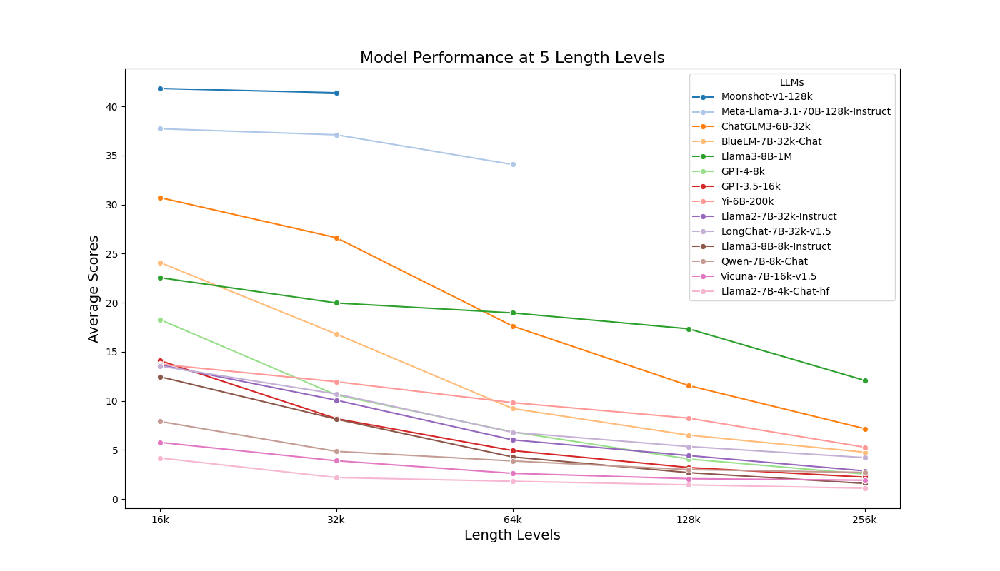

For larger models(70B+), we have evaluated the opensourced Qwen2-72B-Instruct and Meta-Llama-3.1-70B-Instruct, both with 128k context length.

During the testing of Qwen, we configured the Yarn long-text extension according to the official repository. However, the model failed to generate correct outputs during the evaluation. We also found similar unresolved issues in the official repository(https://huggingface.co/Qwen/Qwen2-72B-Instruct/discussions/17, https://github.com/QwenLM/Qwen2/issues/717). Therefore, here we only present the results of the 16k valid tests.

```json
# results of Qwen2-72B-Instruct at 16k length level
{
    "cmrc_mixup_16k": 37.05,
    "dureader_mixup_16k": 20.86,
    "factrecall_en_16k": 4.95,
    "factrecall_zh_16k": 12.7,
    "hotpotwikiqa_mixup_16k": 31.98,
    "lic_mixup_16k": 29.06,
    "loogle_CR_mixup_16k": 14.97,
    "loogle_MIR_mixup_16k": 16.61,
    "loogle_SD_mixup_16k": 52.04,
    "multifieldqa_en_mixup_16k": 25.4,
    "multifieldqa_zh_mixup_16k": 32.8
}
```

We have completed the evaluations for Meta-Llama-3.1-70B-Instruct on 16k/32k/64k length levels, and drew the performance result in the following line graph. Due to the significant computational cost associated with the 70B long-context model, the evaluations for the 128k and 256k levels are still ongoing. The results will be updated upon completion.

For close models with long-context capability, we present the results of Kimi(api moonshot-v1-128k). Due to the high cost(707.52M tokens, 42451.2RMB) of evaluation on all five length levels, we can only bear the cost of evaluation on 16k and 32k length levels. We hope this partial results can provide a performance reference for SOTA long-context LLMs.


